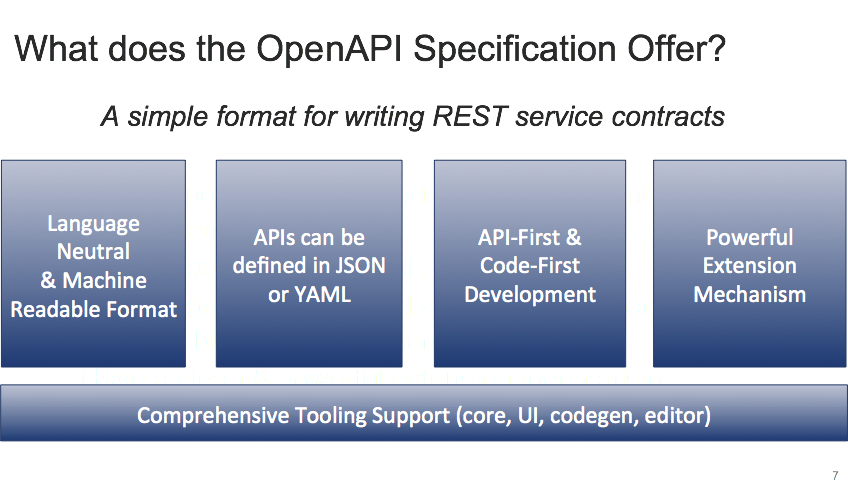

[appendix]

== The Open API Initiative and Specification

[float]
=== OpenAPI Overview

The goal of the https://openapis.org/specification[OpenAPI Specification] is to define a standard, language-agnostic interface to REST APIs which allows both humans and computers to discover and understand the capabilities of the service without access to source code, documentation, or through network traffic inspection. When properly defined via OpenAPI, a consumer can understand and interact with the remote service with a minimal amount of implementation logic. Similar to what interfaces have done for lower-level programming, OpenAPI removes the guesswork in calling the service.

The capabilities of a service are described in the structure of the OpenAPI Specification. Not all services can be described by OpenAPI--this specification is not intended to cover every possible use-case of a REST-ful API. OpenAPI does not define a specific development process such as design-first or code-first. It does facilitate either technique by establishing clear interactions with a REST API.

A starting point for OpenAPI is this https://github.com/OAI/OpenAPI-Specification[GitHub project] where you will find the information about the OpenAPI Specification, a simple static sample of what it looks like, and some general information regarding the project.

[float]
=== OpenAPI Governance and Mission

The https://openapis.org/governance[Governance and Mission] of the Open API Initiative (OAI) is to provide an open source, technical community, within which industry participants may easily contribute to building a vendor-neutral, portable and an open specification for providing technical metadata for REST APIs - the “Open API Description Format” (OADF).

The Open API Initiative is be composed of:

- Corporate members (OAI Members) that have executed an OAI Membership Agreement to sponsor the activities of the OAI Community

- Business Governance Board (BGB);  The Business Governance Board is intended to provide a minimalist governance structure around the development and use of the OAI trademarks.  The intention is for the OAI to operate by consensus. However, if consensus cannot be achieved, the Business Governance Board shall vote on a decision.

- Technical Developer Community (“TDC”), open to any participant, whether an OAI Member or not; The TDC will only accept influence through contributions; the primary means for any organization to influence the technical direction of the OADF is via contribution or service as maintainers.

- Technical Oversight Board (“TOB”). The TOB is responsible for managing conflicts, violations of procedures or guidelines and any cross-project or high-level issues that cannot be resolved in the TDC

Core Values. The TDC and TOB shall reflect and adhere to the following values for its activities and the OADF:

a.      Open access: information on the OAI, its proceedings, this charter and the OADF themselves shall be publicly available for viewing on the web.

b.      Collaborative: interested parties shall have the means to freely contribute ideas, solutions, commentary and other input to the evolution of the OADF.

c.      Meritocratic and contribution driven development: influence on the development of the OADF is based purely on the importance and merit of the contributions made.

d.      Pragmatic. The OADF should prioritize to solve real world problems over supporting academic / abstract concepts.

e.      Extendable. The OADF should allow domain-specific extensions to adhering definitions - enabling the use of the OADF without having to be in conflict with their core functionality.

f.       Stable. The OADF should evolve in a pace that allows adopters to support its functionality within a “reasonable timeframe”; its evolution should favor the aim to provide a stable foundation for API metadata over adding new functionality as any immediate needs arise.

g.      Intellectual Property Neutral: the OADF must be available for use free of charge to members and non-members alike. This usage applies to commercial and non-commercial use by any individual organization complying with a set of non-discriminatory usage principles set forth by the Business Governance Board.

IP Policy.

a.      All new inbound specification or code contributions to the OAI shall be made under the Apache License, Version 2.0 (available at http://www.apache.org/licenses/LICENSE-2.0) accompanied by a Developer Certificate of Origin sign-off (http://developercertificate.org);

b.      All outbound specifications or code will be made available under the Apache License, Version 2.0.

c.      All documentation will be received and made available by OAI under the Creative Commons Attribution 4.0 International License.

[float]
=== Relevance to OGC

A telecon was held of OAI and OGC staff members on 2016-08-11 to discuss each others organization and to consider possible coordination.

Main points of the discussion from OGC were:

- OGC is a standards and incubator for geospatial technology
- OGC is advancing a discussion about geospatial APIs
- We are looking at API best practices beyond geospatial.
- An OGC member suggested we look at OpenAPI or Swagger
- Could the OpenAPI spec be a basis for geospatial API design?

After the telecon the OAI staff provided a series of relevant links, from the OAI web site and external links that highlight the value of the OpenAPI Specification:

- https://openapis.org/news/blogs/2016/08/open-api-initiative-six-months-and-counting-recording[Open API Initiative: Six months and counting]
- https://openapis.org/news/blogs/2016/07/you-can-get-involved-creating-openapi-specification-and-heres-how[You Can Get Involved in Creating the OpenAPI Specification, And Here's How]

- https://openapis.org/news/blogs/2016/05/grpc-rest-and-openapi-specification[gRPC with REST and OpenAPI Specification]

- https://developer.capitalone.com/blog-post/leapfrogging-with-rest-api-design/[Leapfrogging with REST API Design - Capital One DevExchange]

- https://www.docusign.com/blog/swagger-to-the-max/[Swagger to the Max (DocuSign)]

- https://apis.guru/browse-apis/[An unofficial, non-exhautive list of APIs leveraging the OAS Specification]

An example of OAI activities is how Capital One was able to leverage the assistance from other OAI members before launching their open source code generation tool, now available on https://github.com/capitalone/oas-nodegen[GitHub].
[float]
=== Summary Graphic

