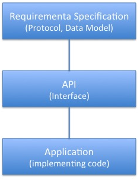

== What is an API?

=== API defined 

This chapter discusses software engineering definitions for APIs. 

**API (Application Programming Interface)** - An interface that is defined in terms of a set of functions and procedures, and enables a program to gain access to facilities within an application. (Definition from Dictionary of Computer Science - Oxford Quick Reference, 2016)

**Interface** - a shared boundary between two functional units, defined by various characteristics pertaining to the functions, physical interconnections, signal exchanges, and other characteristics, as appropriate (Definition from ISO/IEC 2382:2015 Information technology - Vocabulary)
 
The purpose of an API is to provide a well-known interface between components of a software system. APIs are useful in software development as they support modularity. Well defined interfaces allows seperation of functionality into independent, interchangeable modules. 

APIs are popular today as they allow an organization to publize their API for reuse. There are now over 12,000 public APIs available across a wide range of market sectors, a thirtyfold increase since 2006 - see http://www.programmableweb.com/[ProgrammableWeb]. Some of the public APIs handle billions of requests per day. Public APIs enable an ecosystem that developers from other organizations use to access the functionality provided behind the API.  APIs are closely related to role of platforms.  For example the Facebook API provides functionality used by multiple organizations thereby advancing the market value of the Facebook platform. APIs provide a “stickiness” for the ecosystem.

Public APIs may or may not be Open APIs.  Open APIs adhear to open principles such as those defined by https://open-stand.org/about-us/principles/[OpenStand]: 1. Cooperation, 2. Adherence to Principle (including broad consensus), 3. Collective Empowerment, 4. Availability, and  5. Voluntary Adoption.  OGC standards go beyond OpenStand principles as all OGC standards are free to download and are royalty-free. 

=== APIs in context

<<<<<<< HEAD
APIs are one of the tools used by software engineers and developers to design modular and interoperable systems.  From an OGC open standards perspective, APIs are understood in the context of standards and implementing code.
=======
The https://en.wikipedia.org/wiki/Application_programming_interface[application programming interface (API)] entry on Wikipedia defines an API as an interface that supports modularity and separation of components. The components can be implemented independently with the API serving as the common point of exchange. The notion of "API as an Interface" makes the API discussion relevant to the activities of the OGC.  
>>>>>>> origin/master

**Requirement Specifications** are documents that define required  aspects for implementing a protocol or data model to solve an  interoperability problem. A protocol is the set of requirements that end points in a distributed system use when they communicate. The requirements may be written in plain text or in a technology neutral modeling language like UML.  OGC standards specify requirements for interfaces and encodings using a modular approach (OGC 08-131r3). Implementations of an OGC standard must satisfy requirements by passing the tests of conformance suites. The requirements apply across multiple API implementations. 

**APIs** are interfaces that when backed by implementing code will satisfy a requirements specification for an interoperability need. The API is a set of functions and procedure written in declarative code that enables a program to access an application. For bindings in most programming languages (C++, JAVA and other OOPL) the declarative code can be initially generated from the UML and  UML can be generated from the declarative code.  In addition to meeting a requirements specification, the design of an API must also take into account aspects of the programming language used for the API.

**Applications** are software programs that meet user needs. Applications are distinct from system software including the operating system and system utilities.  Applications implement algorithms to provide functionality behind APIs. The particulars of the algorithm are not important to the protocols.  A development strategy is to implement methods in the simplest manner possible and then do system testing and measurement to identify performance issues to optimize code, which is usually an algorithmic issue and independent of the protocol definitions.  

=== Diversity of APIs

The https://en.wikipedia.org/wiki/Application_programming_interface[application programming interface (API)] entry on Wikipedia defines API as an interface that supports modularity and separation of components. The components can be implemented independently with the API serving as the common point of exchange. It is the notion of "API as an Interface" that makes it relevant to the activities of the OGC.  

As defined in https://portal.opengeospatial.org/files/?artifact_id=64860[OGC® Testbed 11 REST Interface Engineering Report], OGC Document 15-052r1, an API is an interface definition that permits invoking services from application programs without knowing details of their internal implementation.

The APIs listed next show the diversity of the API concept while still retaining the core concept that "APIs are interfaces."
[float]
==== OGC GeoAPI 

http://www.geoapi.org/[The OGC GeoAPI standard] provides a set of Java language programming interfaces for geospatial applications.

The GeoAPI interfaces closely follow the abstract model and concrete specifications published collaboratively by the http://www.isotc211.org/[International Organization for Standardization] (ISO) in its 19100 series of documents and the http://www.opengeospatial.org/[Open Geospatial Consortium] (OGC) in its abstract and implementation standards.

The GeoAPI interfaces provide a layer which separates client code, which would call the API, from library code, which implements the API. This follows a similar pattern to the well-known http://download.oracle.com/javase/6/docs/technotes/guides/jdbc/[JDBC] API which provides a standardized interface to databases. Clients can use the JDBC API without concern for the particular implementation which they will use. Various groups have implemented different subsets of GeoAPI, see the http://www.geoapi.org/implementations.html[list of known implementations] for details.
[float]
==== APIs on the Web - WebAPIs

Traditionally, the Web follows the Internet approach of https://www.w3.org/TR/webarch/#protocol-interop[Protocol-Based Interoperability] where the protocols specifying the syntax, semantics, and sequencing constraints of the messages interchanged. Protocols designed to be resilient in the face of widely varying environments have helped the Web scale and have facilitated communication across multiple trust boundaries. Traditional APIs do not always take these constraints into account. One effect of protocol-based design is that the technology shared among agents often lasts longer than the agents themselves.

More recently Web development has developed the concpet of a WebAPI.  A https://en.wikipedia.org/wiki/Web_API[WebAPI] is an API for either a web server or a web browser.  For APIs in a web context, the concepts of endpoints, resources and services become part of WebAPI discussions.

- A server-side WebAPI is a programmatic interface consisting of one or more publicly exposed endpoints to a defined request-response message system, typically expressed in JSON or XML, which is exposed via the web, most commonly by means of an HTTP-based web server. 

- A client-side WebAPI is a programmatic interface to extend functionality within web browser or other HTTP client. Originally these were most commonly in the form of native plug-in architectures however most newer ones target standardized JavaScript bindings.
[float]
==== OGC Protocols for WebAPIs

http://www.opengeospatial.org/standards[OGC Web Service (OWS) Standards] applicable to WebAPIs include WMS, WMTS, WFS, WCS, WPS, WCPS, SOS, SPS, CSW, and OpenLS. (NOTE - above there is a statement that OGC interface standards are protocols .. .)

The OWS standards define requirements for server-side WebAPIs. The requirements cover function and structure of the protocols to be met by the WebAPIs. The OWS standards as currently written do not specify source code so cannot be called APIs.  

The OWS Standards are requirement specifications on the web protocols. https://en.wikipedia.org/wiki/Application_layer#Application_layer_protocolsl[Application protocols] specify interfaces and operations. For example, http is a protocol standard. The OWS standards provide conformance tests to confirm that performance requirements are met by implementations.  The OWS standards do not specify the API design.  Multiple APIs can achieve the OWS Protocols - as can be seen in Section 2.

The existing OWS standards could be used to assess conformance of WebAPIs to the requirements in the OGC standards.  To do so a different set of conformance classes would need to be written in the OGC Standards.
[float]
==== Landing Pages as APIs

The advent of distributed Hypermedia, in particular the World Wide Web, has introduced a new pattern of distributed processing.  In this pattern, users follow links from one resource to the next.  Each resource provides the information needed to proceed to the next set of resources.  This pattern assumes a simple protocol (URLs over HTTP).  Landing Pages are an emerging approach to document an API using this pattern.  A landing page is a collection of web pages which document the API.  The web pages also include URLs which can be accessed using the HTTP protocol to exercise the advertised capabilities.

Two examples of landing page APIs are:
http://developer.deere.com/#/home/landing[John Deer] and
http://dev.twitter.com/overview/documentation[Twitter]

=== Summary

<<<<<<< HEAD
* APIs are interfaces that implement requirements for protocols or data models
* OGC Web Service standards specify web protocols based on http.
* OWS standards have been implemented in numerous APIs - see Chapter 2.

