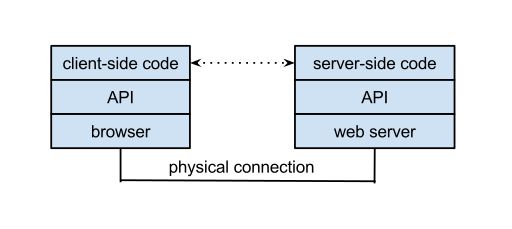

== What is an API?

=== API defined

This chapter discusses software engineering definitions for APIs.

**API (Application Programming Interface)** - An interface that is defined in terms of a set of functions and procedures,
and enables a program to gain access to facilities within an application.
(Definition from Dictionary of Computer Science - Oxford Quick Reference, 2016)

**Interface** - a shared boundary between two functional units,
defined by various characteristics pertaining to the functions, physical interconnections, signal exchanges,
and other characteristics, as appropriate (Definition from ISO/IEC 2382:2015 Information technology - Vocabulary)

The value of APIs is to provide well-known interfaces between components of a software system.
APIs are useful in software development as they support modularity.
Well defined interfaces allow separation of functionality into independent, interchangeable modules.
APIs are often materialized as web-services,
but are also commonly targeted at a specific programming language, typically Javascript.
This difference in ‘level’ is arbitrary and they serve more or less the same purpose,
to abstract useful functionality in a convenient interface.

APIs are popular today as they allow an organization to publize their APIs for reuse.
There are now over 12,000 public APIs available across a wide range of market sectors,
a thirtyfold increase since 2006 - see http://www.programmableweb.com/[ProgrammableWeb].
Some public APIs handle billions of requests per day.
Public APIs enable an ecosystem that developers from other organizations use to access the functionality provided behind the APIs.
APIs are closely related to role of "platforms".
For example the Facebook API provides functionality used by multiple organizations
thereby advancing the market value of the Facebook platform.
APIs promote “stickiness” to a platform.

Public APIs may or may not be Open APIs.
Being "public" means that the API is visible and accessible outside of the organization that owns the API.
The organization that controls and promotes the API owns the API.
Open APIs are similar to open standards in that Open APIs are managed as a public good and managed in an open process.
Open APIs adhere to open principles such as those defined by https://open-stand.org/about-us/principles/[OpenStand]:
1. Cooperation,
2. Adherence to Principles (including broad consensus),
3. Collective Empowerment,
4. Availability, and
5. Voluntary Adoption.
OGC standards go beyond OpenStand principles as all OGC standards are free to download and are royalty-free.

=== APIs in context

APIs are tools used by software engineers and developers to design modular and interoperable systems.
From an OGC open standards perspective, APIs are understood in the context of requirement specifications and implementing code.

image::images/APIinContext.png[title=APIs in Context,scaledwidth="40%"]

**Requirements Specifications** are documents that define aspects of a protocol or data model to solve an interoperability problem.
A protocol is the set of requirements that end points in a distributed system use when they communicate.
The requirements may be written in plain text or in a technology neutral modeling language like UML.
OGC standards specify requirements for interfaces and encodings using a modular approach (OGC 08-131r3).
Implementations of an OGC standard must satisfy requirements as demonstrated by passing conformance tests.
The requirements apply across multiple API implementations.

**APIs** are interfaces that when backed by implementing code satisfy an interoperability need that may be documented in a Requirements Specification.
The API package is a set of functions and procedure calls written in declarative code that enables a program to access an application.
For bindings in most programming languages (C++, JAVA and other Object Oriented programming languages) the declarative code can be initially generated from UML and UML can be generated from the declarative code.  The design of an API must also take into account aspects of the particular programming language.

**Applications** are software programs accessible by an API that meet user needs.
Applications are distinct from system software including the operating system and system utilities.
Applications implement algorithms to provide functionality behind APIs.
The particulars of the algorithm are distinct from the protocols.
A development strategy is to implement methods in the simplest manner possible
and then do system testing and measurement to identify performance issues to optimize code,
which is usually an algorithmic issue and independent of the protocol definitions.

=== Diversity of APIs

The https://en.wikipedia.org/wiki/Application_programming_interface[application programming interface (API)] entry on Wikipedia
defines API as an interface that supports modularity and separation of components.
The components can be implemented independently with the API serving as the common point of exchange.
It is the notion of "API as an Interface" that makes it relevant to the activities of the OGC.

As defined in https://portal.opengeospatial.org/files/?artifact_id=64860[OGC® Testbed 11 REST Interface Engineering Report],
OGC Document 15-052r1, an API is an interface definition that permits invoking services from application programs
without knowing details of their internal implementation.

The APIs listed next show the diversity of the API concept
while still retaining the core concept that "APIs are interfaces."
[float]
==== OGC GeoAPI Standard

http://www.geoapi.org/[The OGC GeoAPI standard] provides a set of Java language programming interfaces for geospatial applications.
The GeoAPI interfaces closely follow the abstract model and concrete specifications published collaboratively by
the http://www.isotc211.org/[International Organization for Standardization] (ISO) in its 19100 series of documents and
the http://www.opengeospatial.org/[Open Geospatial Consortium] (OGC) in its abstract and implementation standards.

The GeoAPI interfaces provide a layer which separates client code from application code, which implements the API.
This follows a similar pattern to the well-known http://download.oracle.com/javase/6/docs/technotes/guides/jdbc/[JDBC API]
which provides a standardized interface to databases.
Clients can use the JDBC API without concern for the particular implementation which they will use.
Various groups have implemented different subsets of GeoAPI,
see the http://www.geoapi.org/implementations.html[list of known implementations] for details.
[float]
==== APIs and the Web - WebAPIs

The Web follows the Internet approach of https://www.w3.org/TR/webarch/#protocol-interop[Protocol-Based Interoperability]
where the protocols specifying the syntax, semantics, and sequencing constraints of the messages interchanged.
Protocols designed to be resilient in the face of widely varying environments have helped the Web scale
and have facilitated communication across multiple trust boundaries.
Traditional APIs do not always take these constraints into account.
One effect of protocol-based design is that the technology shared among agents often lasts longer than the agents themselves.
To support Web development the concept of a WebAPI was defined.
A https://en.wikipedia.org/wiki/Web_API[WebAPI] is an API for either a web server or a web browser.

[float]
==== OGC Protocols for WebAPIs

http://www.opengeospatial.org/standards[OGC Web Service (OWS) Standards] define Protocols that can be implemented as WebAPIs.
The OWS standards are Requirements Specifications that define a protocol and in some cases a data model.
The OWS standards include WMS, WMTS, WFS, WCS, WPS, WCPS, SOS, SPS, CSW, and OpenLS.

The OWS standards define requirements to be satisfied by both client-side and server-side WebAPIs.
The OWS standards as currently written do not specify declarative code bindings.
The OWS standards do not specify API design, i.e., functions and procedure calls.
Multiple API designs can satisfy the OWS requirements - as can be seen in Section 2.

The OWS standards are the basis for OGC Conformance Tests that are used to confirm that functional requirements are met by implementations.
OGC Compliance Tests have predominatly focused on server-side testing, while more recently client-side compliance tests have been defined for WMS.

[float]
==== REST Architecture for OGC Web Services

REST (Representational State Transfer) is a term coined by Roy Fielding in his doctoral dissertation
to describe an architectural style for “distributed hypermedia systems” such as the Worldwide Web that
are to have desirable characteristics including separation of concerns, scalability, resiliency, visibility, and reliability.
The REST architectural style rests on five constraints on how computing systems are configured and component interactions are carried out
(see for example http://www.restapitutorial.com/[= A RESTful Tutorial]).
Examples of non-open standard RESTful web mapping APIs are provided in Chapter 2.

OGC Web Services (OWS) were defined before the publication of REST principles.
OGC has evaluated the implications of REST vis-a-vis OWS finding that the existing OWS Standards have aspects of REST
but also that OGC services should be migrated to, or at least make available as more RESTful bindings.
For example, https://portal.opengeospatial.org/files/?artifact_id=64860[The OGC Testbed 11 REST Interface Engineering Report]
defines possible uniform practices for developing bindings or interaction styles for OGC Web services that appropriately leverage REST principles.
OGC Testbed 12 continues these developements and will conclude later this year.

One aspect of this analysis is the use of Landing Pages to document APIs.
The advent of distributed Hypermedia, in particular the World Wide Web, has introduced a new pattern of distributed processing.
In this pattern, users follow links from one resource to the next.
Each resource provides the information needed to proceed to the next set of resources.
This pattern assumes a simple protocol (URLs over HTTP).
Landing Pages are an emerging approach to document an API using this pattern.
A landing page is a collection of web pages which document the API.
The web pages also include URLs which can be accessed using the HTTP protocol to exercise the advertised capabilities.

Two examples of landing page APIs are:
http://developer.deere.com/#/home/landing[John Deer] and
http://dev.twitter.com/overview/documentation[Twitter]

=== Summary

* APIs are interfaces that implement requirements for protocols or data models
* OGC Web Service standards specify web protocols based on http.
* OWS standards have been implemented in numerous APIs - see Chapter 2.
