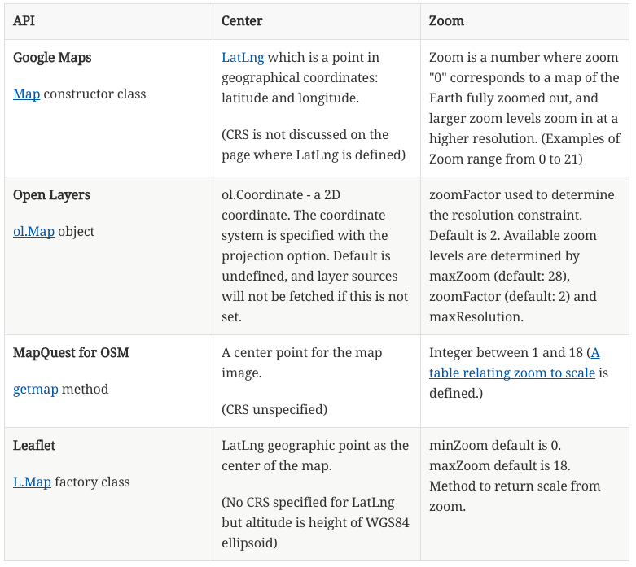

== Need for Interoperability across APIs

=== The Proliferation of Public APIs

This Chapter considers the variation in existing geospatial APIs as the motivation for proposing API design based on open standards.  The objective is to promote wide spread interoperability based on open API design while maintaining competitive opportunities.

There are many public APIs. As of November 2016,
http://www.programmableweb.com/apis/directory[The Programmable Web] listed over 16,000 public APIs. (See Chapter 5 for distinction between public and open.)  http://blog.programmableweb.com/2013/10/07/api-design-is-stuck-in-2008/[Richardson] identified challenges with the proliferation of APIs including +

* "Thousands of APIs are superficially similar but mutually incompatible
* Everyone has a slightly different view of basic real-world concepts like “person” and “event”
* This lack of agreement makes it impossible to create client-side software that can be reused between APIs
* It’s not hard to find two APIs that do exactly the same thing but have nothing in common except the application/json media type."

The recent proliferation of APIs for geospatial applications has degraded the interoperability previously established by open standards.  This degradation is do both to the variability of API practices across the IT industry as well as variability in geospatial APIs specifically.

Advancements in API practices is needed across the software development profession. "APIs are often difficult to use, and programmers at all levels, from novices to experts, repeatedly spend significant time learning new APIs. APIs are also often used incorrectly, resulting in bugs and sometimes significant security problems." (http://cacm.acm.org/magazines/2016/6/202645-improving-api-usability/["Improving API Usability" in the Communications of the ACM])

=== Example variations in Web Mapping APIs

Web mapping APIs define interfaces and bindings to access maps over the web.  This section provides examples of variation across existing geospatial APIs to demonstrate the need for improved API design practices.
While web mapping APIs are defined in multiple programming languages,
the examples in this chapter focus on JavaScript.

APIs for web mapping were listed in
http://www.programmableweb.com/news/top-10-mapping-apis-google-maps-microsoft-bing-maps-and-mapquest/analysis/2015/02/23[The Programmable Web]
with the "top ten" being: Google Maps, Microsoft Bing Maps, OpenLayers, Foursquare, OpenStreetMap, MapQuest, Mapbox, CartoDB, Esri, and Yahoo.
Some of these APIs implement the WMS Protocol either explicitly or as an extension - others do not support WMS, defining their own semantics and syntax for web mapping.

Annex A lists details and code snippets for these Web Mapping API examples: Google Maps, OpenLayers, MapQuest API for OpenStreetMap, Leaflet.  Additionally two more RESTful examples are listed in Annex A: Esri ArcGIS REST and Mapbox.

The Web Mapping APIs listed in the Annex A use similar concepts sometimes in attributes differing names.
The Table below lists two such attributes  - "Center" and "Zoom" - that are in the four example APIs.  "Center" is the center point of the web map to be displayed.  "Zoom" is related to the scale of the web map to be displayed.  The concepts for these attributes are similar in each API but the precise specification is different in each case.

The variability of similar concepts across different APIs as seen in Table 1 suggests an opportunity to quickly converge on a small set of "essential" attributes usable across otherwise disparate APIs.  This simple example motivates the discussion about geospatial domain mapping and OGC Essentials for geospatial APIs based on open standards.

<<<

Table.  Comparison of Map-related attributes from several APIs

////
[width="80%", options="header"]
|=======================
|API|Center      |Zoom
|**Google Maps**

 https://developers.google.com/maps/documentation/javascript/reference#MapOptions[Map] constructor class   |https://developers.google.com/maps/documentation/javascript/reference#LatLng[LatLng] which is a point in geographical coordinates: latitude and longitude.

(CRS is not discussed on the page where LatLng is defined)
| Zoom is a number where zoom "0" corresponds to a map of the Earth fully zoomed out, and larger zoom levels zoom in at a higher resolution.  (Examples of Zoom range from 0 to 21)

|**Open Layers**

http://openlayers.org/en/v3.13.0/apidoc/ol.View.html[ol.Map] object
|ol.Coordinate - a 2D coordinate.  The coordinate system is specified with the projection option. Default is undefined, and layer sources will not be fetched if this is not set.

|zoomFactor	used to determine the resolution constraint. Default is 2.
 Available zoom levels are determined by maxZoom (default: 28), zoomFactor (default: 2) and maxResolution.
|**MapQuest for OSM**

http://open.mapquestapi.com/staticmap/#getmap[getmap] method
|A center point for the map image.

(CRS unspecified)
|Integer between 1 and  18 (http://open.mapquestapi.com/staticmap/zoomToScale.html[A table relating zoom to scale] is defined.)
|**Leaflet**

http://leafletjs.com/reference-1.0.0.html#map-factory[L.Map] factory class
| LatLng geographic point as the center of the map.

(No CRS specified for LatLng but altitude is height of WGS84 ellipsoid)
|minZoom default is 0.  maxZoom default is 18.  Method to return scale from zoom.
|=======================
////

=== Interoperability across Multiple Map Servers

Interoperability is a primary objective of the OGC.  Consistent semantics across multiple servers independent of underlying API leads to interoperability and the ability to merge results from the multiple servers.  The figure below was created by making individual requests to several map services (the text in each “square” indicates the name of the server).  The figure illustrates what can be done if services use the same indexing systems.  The figure uses the “indexing system” defined in the WMTS Simple.

image::images/MultipleMaps.png[title=Multiple Maps with common semantics - Interoperablity (Source: Joan Maso)]

<<<
