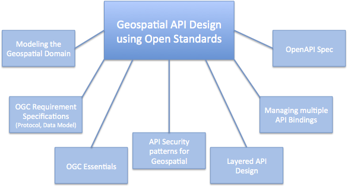
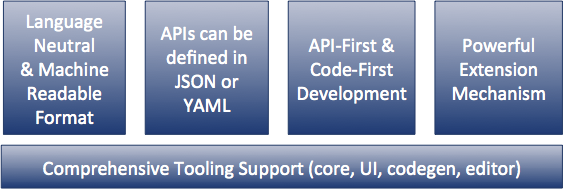
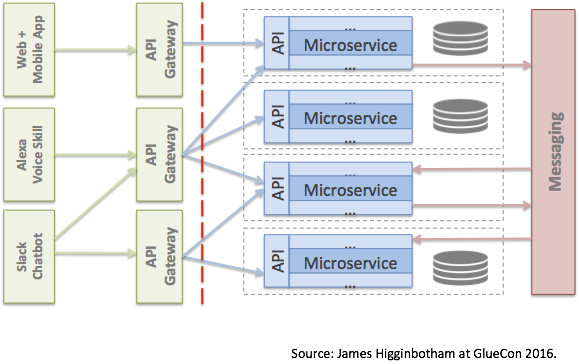

== Geospatial API design based on open standards

To address the challenges of API proliferation addressed in Chapter 2, this Chapter identifies several methods based on open standards for the design of Geospatial APIs based on open Requirement Specifications. +
These topics are addressed in the following sections for this Chapter:

* Modeling the geospatial domain

* API design based on geospatial requirements

* API Specification and Management

* OGC Essentials for API elements

* Managing multiple API Bindings

* Layered API design

* API Security Patterns

The Figure below provides a summary of the topics discussed above  Geospatial API Design using open standards.

The following sections includes Recommendations from "Web APIs for Environmental Data", a report from CSIRO (See Annex B).  The CSIRO report provides Recommendations as a basis to design consistent, cross-organization APIs for access to a range of environmental data products.  Observations from the CSIRO report and listed in this Chapter provide examples of opportunities for improving geospatial API design.

=== Modeling Geospatial Domain Resources

Designing for a connected set of concepts will lead to more robust interactions with domain resources, long term evolvability and fitness for use (http://www.mikestowe.com/blog/2014/11/what-is-spec-driven-development.php[Spec Driven Development]).  Design should consider an interconnected set of API resources with clear ideas and support of why and how API consumers will follow certain paths.
This supports the objective that APIs may not just compete by features, but also by how easily and robustly they can be used (  http://dret.typepad.com/dretblog/2016/08/api-maps-hypermedia-api-design.html[API Maps: Hypermedia API Design])

The CSIRO API Report (Annex B) makes the following observations about modeling the environmental data domain.

* Observation 18: Involve domain specialists in resource design. In organizations as complex as multi-disciplinary environmental agencies, there won’t be a single information model or Web API to rule them all. Rather there exists multiple domain contexts and words with different meaning, e.g. what is a monitoring station? Any domain-level simplifications should be reviewed within these contexts to ensure they make sense.

* Observation 19: Consider point, grid and trajectory abstractions. This has been used effectively in existing APIs as a way of delineating different data types.

Multiple map APIs designed with a consistent domain model will improve development using multiple APIs, e.g., a developer can use an open API to draw the map, open map data from multiple sources in combination with commercial APIs say for advanced features such as traffic or routing.  Capturing the geospatial domain in open Requirements Specifications provides for achieving such domain interoperability.

One aspect of this analysis is the use of Landing Pages to document APIs.
The advent of distributed Hypermedia, in particular the World Wide Web, has introduced a new pattern of distributed processing.
In this pattern, users follow links from one resource to the next.
Each resource provides the information needed to proceed to the next set of resources.
This pattern assumes a simple protocol (URLs over HTTP).
Landing Pages are an emerging approach to document an API using this pattern.
A landing page is a collection of web pages which document the API.
The web pages also include URLs which can be accessed using the HTTP protocol to exercise the advertised capabilities. Two examples of landing page APIs are:
http://developer.deere.com/#/home/landing[John Deere] and
http://dev.twitter.com/overview/documentation[Twitter]

=== API design based on geospatial requirements

As discussed in Chapter 1, Requirements Specifications define protocols and schemas for interoperability across distributed heterogeneous distributed information systems.  APIs that implement the Requirement Specifications support such interoperability.

The OGC Web Service (OWS) Standards are requirements specifications that define geospatial interoperability. The OWS Standards define data structures, behaviors and semantics for protocols based on http. The OWS Standards were initially defined based on a Service Oriented Architecture (SOA).  The OGC Web Map Service was defined with a service interface including multiple operations, e.g., GetMap.   OGC is currently reviewing the OWS Standards in a discussion will lead to addition of more RESTful protocols based on a Resource-Oriented Architecture (ROA).  (See https://portal.opengeospatial.org/files/?artifact_id=64860[OGC Testbed 11 REST Interface Engineering Report])

Consistent with ROA and supportive of RESTful APIs, geospatial resources need to be identified in OGC standards.  Geospatial resources include: feature collection, feature, coverage, map, layer, trajectory, etc.  Relationships are also important to be modeled, e.g. topological associations between features, parent-child associations, etc.

Based on identification of geospatial resources RESTful protocol signatures are being defined for OWS standards.  For example:

http://ows.example.org/dataset/ows/featurecollection/featureID
http://ows.example.org/dataset/ows/coverage/AvgLandTemp

An example defining a relation between a requirements specification and implementing APIs is available in these two standards from the Intelligent Transport Systems (ITS) Domain:

* Unified gateway protocol requirements and specification for vehicle-ITS-station gateway (V-ITS- SG) interface (ISO 13185-2)

* Unified vehicle interface protocol (UVIP) server and client API specification (ISO 13185-3)

Corresponding to services defined in ISO 13185-2, the UVIP Java Client API (ISO 13185-3) contains services that can be called by any application to execute a service.  A UVIP Client Application communicates with a UVIP Server Application.

Resources, protocols, semantics and behaviors defined in Geospatial Requirement Specifications become the basis for API Specification and Management.

=== API Specification and Management

API specification and management are crucial software engineering functions for any organization using information technology.  As the popularity of APIs has grown in the past few years, so too have the tools, best practices and consulting services that support organizations in API specification and management.  While these tools were initially developed for organizations to manage their organization-specific APIs, the tools can also be considered for use in API design in an open standards context.  Here we consider one such tool: the Open API Specification formerly known as the Swagger specification.

Documenting APIs can be aided by using the approach of the https://openapis.org/[OpenAPI Initiative (OAI)].
OAI is focused on defining a vendor neutral API Description Format based on the Open API Specification (OAS).
The approach will allow specification of REST APIs using modular sub-elements.
Sub-elements can then live on their own and be shared by multiple APIs.
More information about OAI and OAS is available in Annex C.

Providing complete documentation of your API using OpenAPI is a
https://www.w3.org/TR/dwbp/#documentYourAPI[W3C Data on the Web Best Practice].
This best practice for APIs is being discussed in the http://www.opengeospatial.org/projects/groups/sdwwg[OGC/W3C Spatial Data on the Web Working Group].

Swagger was used in the https://portal.opengeospatial.org/files/?artifact_id=61224[OGC WaterML2.0 part 2 Interoperability Experiment] to document the CSIRO RESTful API.  The CSIRO API Report (Annex B) makes the following observations:

* Observation 9: Make use of automated API documentation where possible. These can often be synched directly with an implementation version, which helps to minimize divergence. Some also provide interactive (e.g. Swagger) documentation that allows inline requests to be made. This helps to lower the barrier of entry for developers and quickly builds understanding.

* Observation 10: Avoid bleeding edge API description languages and response patterns. There has been an explosion in the number of these. Picking a winner is difficult. Using an overly complex, non-supported service description framework and/or response structure can be an impediment to developers.

An advantage of documenting APIs with OAS is the industry-wide tools and practices that are based on OAS.  The first Figure below shows how OAS enables robust management of software development lifecycle activities.  The second figure below shows the automated generation of client libraries based on code generation tools.  Use of OAS also helps organizations with API response types, including error handling, link updates, moved and re-aggregated resources, etc.

image::images/chapter-02-51bc4.png[title=OAS/Swagger API specification based tools]

The CSIRO API report (Annex B) describes the OpenAPI Specification as a set of tools and services that help API developers generate documentation for APIs. The Swagger UI renders a documentation page that provides full description of endpoints, with in-line forms allowing test calls to be made to services. The UI can be generated from an API specification document, which could be handwritten or generated from a service.

The specification of a service is done using JSON or YAML that follows the Swagger specification schema. A JSON Schema is available to validate specification documents. The specification defines all the standard parts of a RESTful API: the resource endpoints, supported functions (GET, POST, DELETE, OPTIONS etc.), media types, parameters, and responses.

Consistent use of API Specification and Management practices such as the Open API Specification and its support environment will increase consistent use of elements across multiple APIs.  To increase the interoperability across geospatial APIs, use of OGC Essentials in OAS environment should be considered.

=== OGC Essentials for API elements

OGC Essentials as described in the Chapter 4 is a set of items defined in OGC standards and other open standards that can be used in defining geospatial APIs.

Discussions within the OGC have identified value in recommending small bits of OGC specifications for API providers to use.
There would be great value in porting select OGC API Essentials (as defined in Chapter 4) to the OpenAPI specification.

As an alternative to requiring a full-fledged service interface, the OGC API Essentials highlight how modules,
such as Well Known Text, GeoJSON, WMTS, CQL/Filter, GeoPackage, etc. are useful in building APIs.
The OGC approach to modular standards should help with using OGC Essentials separate from their defining standard.
Requirements for modularity are defined in the
https://portal.opengeospatial.org/files/?artifact_id=34762[The Specification Model - A Standard for Modular specifications (08-131r3)].

Reuse of OGC Essentials will lead to consistency, accuracy and reuse across the various APIs.  For example consistently using CRS Well Known Text and the WMTS TileMatrixSet would reduce the variation across web mapping APIs that was identified in Chapter 2.

=== Managing multiple API Bindings

Another aspect of API management is implementation of an API Specification in multiple bindings. Language bindings are part of API packages. Multiple organizations are now posting their public APIs with bindings for multiple SDKs.

The Figure below shows the https://developers.facebook.com/docs/graph-api/reference/v2.7/offer[Facebook "Offer" API].
When the figure was captured the API was shown in http.  Across the top of the image are the available language bindings: PHP, JavaScript, Android, iOS. On the Facebook API page, selecting one of the bindings while change the display to the API in that language.

An example in the geospatial domain comes from https://www.mapbox.com/api-documentation/?language=cURL#map[Mapbox].
The Mapbox API page lists API bindings in cURL, CLI, Python, JavaScript, Java, Swift/Objective-C.

Managing multiple bindings can also involve using protocols other than http.  For example OGC SensorThings API can be implemented in either http or MQTT.  MQTT is used to enhance the SensorThings service publish and subscribe capabilities. SensorThings API follows OData’s specification for requesting entities.  Managing of multiple API Bindings need to also include managing bindings for multiple protocols.

From an open standards point of view, consistent implementation of elements across bindings is critical to protocol level interoperability.  For example, OGC Essentials could be defined for multiple bindings.

=== Layered API design

The focus of API Design using Open Standards is most critical on external APIs.  Organizations design and use both external and internal APIs in the IT systems.  External APIs are those APIs that are made available external to the organization

* External APIs - focused on the user needs - "Experience APIs"

* Internal APIs - providing access to enterprise resources.

Mapping external APIs to internal APIs with business logic integration in API Gateways is depicted in the Figure below.

Graphic
- API Consumer
- External API (including Security)
- Business Logic (repeat multiple levels as necessary)
- Internal APIs
- Enterprise Assets and Data sources.

Figure Source: http://www.slideshare.net/launchany/designing-apis-and-microservices-using-domaindriven-design[James Higginbotham]

External APIs offered by API Gateways are the most fruitful focus for API design using open standards.  With the focus on external interfaces, comes the need to address security as part of the API design.

=== API Security Patterns for geospatial

API security patterns should be developed in coordination with OGC Security DWG.  Initial discussion with the OGC Security SWG focused on a recommendation about "well defined contract around the API" - this comment based on Digital Globe experiences.  For example its important that there be strong typing of XML or JSON so if you have enumerations they are not unbounded.

http://www.opengeospatial.org/standards/sensorthings[The OGC SensorThings API] addresses security in section 7.7 by reference to ITU-T Y.2060

<<<
